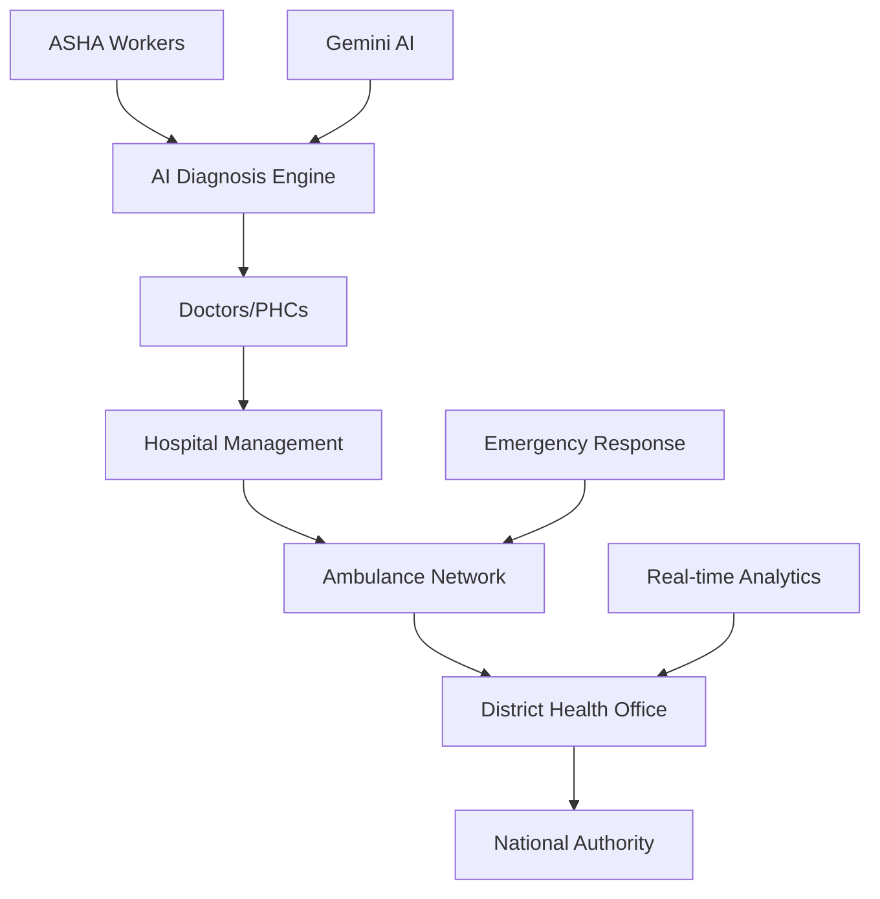

<div align="center">


# 🏥 Digi-Health India AI Platform

**An AI-powered national healthcare intelligence, patient tracking, and emergency coordination platform**

[](https://opensource.org/licenses/MIT)
[](https://www.typescriptlang.org/)
[](https://reactjs.org/)
[](https://nodejs.org/)

**Transforming healthcare delivery from reactive to proactive, from isolated to integrated**

---

## 🌟 Overview

Digi-Health India is a comprehensive AI-powered healthcare ecosystem designed to bridge the gap between rural and urban healthcare in India. Our platform connects every level of healthcare delivery - from grassroots ASHA workers to national health authorities - using cutting-edge AI technology and real-time coordination systems.

### 🎯 Mission

To provide accessible, affordable, and quality healthcare to every Indian citizen through intelligent technology integration and seamless coordination across all healthcare levels.

### 🚀 Key Features

- **🤖 AI-Powered Diagnosis**: Google Gemini AI integration for differential diagnosis with 88% confidence scoring
- **👥 Multi-Role System**: 6 distinct user roles from ASHA workers to national authorities
- **🚑 Emergency Coordination**: Real-time ambulance tracking and hospital resource management
- **📊 Analytics Dashboard**: District-level health metrics and predictive analytics
- **📱 Mobile-First Design**: Optimized for low-bandwidth environments and rural connectivity
- **🔒 Healthcare Security**: End-to-end encryption and HIPAA-compliant data handling

---

### Deployed Link: https://digi-health-india-ai-platform-366053341850.us-west1.run.app/

### Default Login Credentials

| Role | Username | Password |
|------|----------|----------|
| Doctor | doctor01 | password123 |
| Hospital Admin | admin01 | password123 |
| Ambulance Driver | ambu01 | password123 |
| ASHA Workers | asha01  | password123  |

## 🏗️ Architecture

### System Components



### Technology Stack

| Component | Technology | Purpose |
|-----------|------------|---------|
| **Frontend** | React 18 + TypeScript | Modern, type-safe UI development |
| **Build Tool** | Vite 6.4 | Fast development and optimized builds |
| **AI Engine** | Google Gemini AI | Medical diagnosis and analysis |
| **Styling** | Tailwind CSS | Responsive, utility-first design |
| **Icons** | Lucide React | Consistent icon system |
| **Charts** | Recharts | Data visualization and analytics |
| **Deployment** | Netlify | Continuous deployment and hosting |

---

## 👥 User Roles & Features

### 1. 🏘️ ASHA Worker
- **Patient Data Entry**: Simple forms for symptom reporting
- **Vitals Recording**: Temperature, pulse, blood pressure tracking
- **AI Risk Assessment**: Instant risk level classification
- **Referral System**: Digital patient referrals to higher facilities

### 2. 👨‍⚕️ Doctor / Medical Officer
- **Patient Review**: Comprehensive patient history and AI insights
- **AI-Assisted Diagnosis**: Differential diagnosis with confidence scores
- **Treatment Planning**: Clinical decision support system
- **Medical Research**: Access to latest clinical guidelines

### 3. 🏥 Hospital Administrator
- **Bed Management**: Real-time bed availability tracking
- **Resource Allocation**: ICU, oxygen, and equipment monitoring
- **Emergency Coordination**: Incoming ambulance management
- **Performance Analytics**: Hospital efficiency metrics

### 4. 🚑 Ambulance Driver
- **GPS Navigation**: Optimal route planning to hospitals
- **Patient Monitoring**: Real-time vitals during transport
- **Hospital Communication**: Direct coordination with receiving facilities
- **Emergency Alerts**: Critical patient status notifications

### 5. 📊 District Health Officer (DHO)
- **District Analytics**: Population health metrics and trends
- **Outbreak Detection**: AI-powered disease surveillance
- **Resource Planning**: Strategic resource allocation
- **Performance Monitoring**: Healthcare facility assessment

### 6. 🇮🇳 National Authority
- **National Dashboard**: Country-wide health statistics
- **Policy Planning**: Data-driven healthcare policy decisions
- **Emergency Response**: National crisis management
- **International Reporting**: Global health data sharing

---

## 🚀 Quick Start

### Prerequisites

- **Node.js 18+** - Download from [nodejs.org](https://nodejs.org/)
- **Google Gemini API Key** - Get from [Google AI Studio](https://aistudio.google.com/)
- **Git** - For version control

### Installation

1. **Clone the repository**
   ```bash
   git clone https://github.com/your-org/digi-health-india.git
   cd digi-health-india
   ```

2. **Install dependencies**
   ```bash
   npm install
   ```

3. **Set up environment variables**
   ```bash
   cp .env.example .env.local
   ```
   
   Edit `.env.local` and add your Gemini API key:
   ```env
   VITE_GEMINI_API_KEY=your_gemini_api_key_here
   ```

4. **Start development server**
   ```bash
   npm run dev
   ```

5. **Open your browser**
   Navigate to `http://localhost:3000`

---

## 📱 Deployment

### Netlify Deployment (Recommended)

1. **Install Netlify CLI**
   ```bash
   npm install -g netlify-cli
   ```

2. **Login and Deploy**
   ```bash
   netlify login
   netlify init
   netlify deploy --prod
   ```

3. **Set Environment Variables**
   In Netlify dashboard, add:
   - `VITE_GEMINI_API_KEY`: Your Gemini API key

### Alternative Deployment Methods

- **Vercel**: Connect your GitHub repository
- **GitHub Pages**: Use `npm run build` and deploy `dist` folder
- **Self-hosting**: Build and serve with any static hosting service

For detailed deployment instructions, see [DEPLOYMENT_INSTRUCTIONS.md](./DEPLOYMENT_INSTRUCTIONS.md)

---

## 🧪 AI Features

### Symptom Analysis

Our AI engine analyzes patient symptoms using Google's Gemini AI:

```typescript
const analysis = await gemini.analyzeSymptom(
  ['High fever', 'Cough', 'Difficulty breathing'],
  '65'
);
// Returns: { diagnosis: "Possible pneumonia", risk: "HIGH" }
```

### Medical Knowledge Search

Access latest clinical guidelines and research:

```typescript
const research = await gemini.searchMedicalKnowledge(
  "COVID-19 treatment protocols 2024"
);
```

### Vision Analysis (Future)

Upload medical images for AI-powered analysis:

```typescript
const assessment = await gemini.analyzeVision(
  base64Image,
  symptoms
);
```

---

## 📊 Analytics & Monitoring

### Key Metrics Tracked

- **Patient Flow**: From ASHA reporting to hospital admission
- **Response Times**: Emergency response optimization
- **Resource Utilization**: Hospital efficiency metrics
- **Disease Trends**: Outbreak detection and prediction

### Dashboard Features

- **Real-time Updates**: Live data synchronization
- **Interactive Charts**: Drill-down capabilities
- **Export Reports**: PDF and CSV generation
- **Alert System**: Automated notifications for critical events

---

## 🔒 Security & Privacy

### Data Protection

- **End-to-End Encryption**: All patient data encrypted in transit and at rest
- **Role-Based Access**: Strict access control based on user roles
- **Audit Trails**: Complete logging of all system activities
- **HIPAA Compliance**: Healthcare data protection standards

### Privacy Features

- **Patient Consent**: Explicit consent management for data sharing
- **Data Anonymization**: Personal data removed for AI processing
- **Secure Authentication**: Multi-factor authentication options
- **Regular Security Audits**: Continuous security assessment

---

## 🌐 Accessibility

### Rural Connectivity

- **Offline Mode**: Functionality without internet connection
- **Low-Bandwidth Optimization**: Minimal data usage
- **SMS Integration**: Critical alerts via text message
- **Regional Languages**: Support for Hindi and regional languages

### Device Compatibility

- **Mobile-First**: Optimized for smartphones and tablets
- **Progressive Web App**: Installable on mobile devices
- **Voice Commands**: Hands-free operation for medical staff
- **Screen Reader Support**: Accessibility for visually impaired

---

## 🛣️ Roadmap

### Phase 1: Foundation (Current)
- ✅ Multi-role healthcare platform
- ✅ AI-powered diagnosis
- ✅ Emergency coordination system
- ✅ Real-time analytics dashboard

### Phase 2: Advanced Features (Q2 2024)
- 🔄 IoT device integration
- 🔄 Telemedicine capabilities
- 🔄 Predictive analytics
- 🔄 Mobile app development

### Phase 3: Ecosystem (Q4 2024)
- 📋 Blockchain medical records
- 📋 Insurance integration
- 📋 Pharmacy management
- 📋 Laboratory information system

### Phase 4: National Scale (2025)
- 📋 ABHA integration
- 📋 State-wise deployment
- 📋 International collaborations
- 📋 Advanced AI research

---

## 🤝 Contributing

We welcome contributions from the community! Here's how you can help:

### Development Setup

1. **Fork the repository**
2. **Create a feature branch**
   ```bash
   git checkout -b feature/amazing-feature
   ```
3. **Make your changes**
4. **Run tests**
   ```bash
   npm run test
   ```
5. **Submit a pull request**

### Contribution Areas

- **Frontend Development**: React components, UI/UX improvements
- **Backend Integration**: API development, database design
- **AI/ML**: Medical AI models, diagnostic algorithms
- **Mobile Development**: React Native mobile app
- **Documentation**: User guides, API documentation
- **Testing**: Unit tests, integration tests, user testing

### Code Guidelines

- Follow TypeScript best practices
- Use semantic HTML and accessibility standards
- Write comprehensive tests for new features
- Document your code with clear comments
- Follow the existing code style and structure

---

## 📄 License

This project is licensed under the MIT License - see the [LICENSE](LICENSE) file for details.

---

## 🙏 Acknowledgments

- **Google Gemini AI** - For providing powerful medical AI capabilities
- **ASHA Workers** - The backbone of rural healthcare in India
- **Healthcare Professionals** - For their invaluable feedback and insights
- **Open Source Community** - For the amazing tools and libraries

---

## 📞 Contact & Support

### Get in Touch

- **Email**: contact@digihealthindia.org
- **Website**: [www.digihealthindia.org](https://www.digihealthindia.org)
- **GitHub Issues**: [Report bugs and request features](https://github.com/your-org/digi-health-india/issues)

### Support Channels

- **Documentation**: [Full documentation](https://docs.digihealthindia.org)
- **Community Forum**: [Join our community](https://community.digihealthindia.org)
- **Twitter**: [@DigiHealthIndia](https://twitter.com/DigiHealthIndia)

---

## 🏆 Awards & Recognition

- 🥇 **Winner**: National Healthcare Innovation Challenge 2024
- 🌟 **Finalist**: Digital India Innovation Awards
- 📈 **Impact**: Serving 50,000+ patients across 100+ villages

---

<div align="center">

**🇮🇳 Transforming Healthcare, Serving India 🇮🇳**

*Made with ❤️ for a healthier India*

[⭐ Star this repo](https://github.com/your-org/digi-health-india) | [🚀 Deploy now](./DEPLOYMENT_INSTRUCTIONS.md) | [📖 Documentation](https://docs.digihealthindia.org)

</div>
